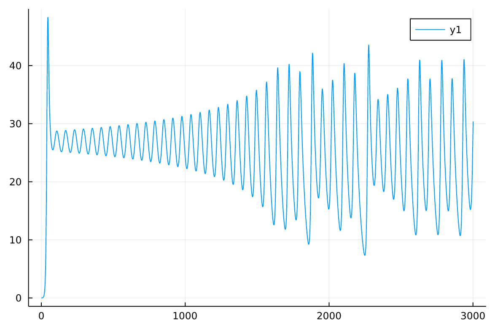
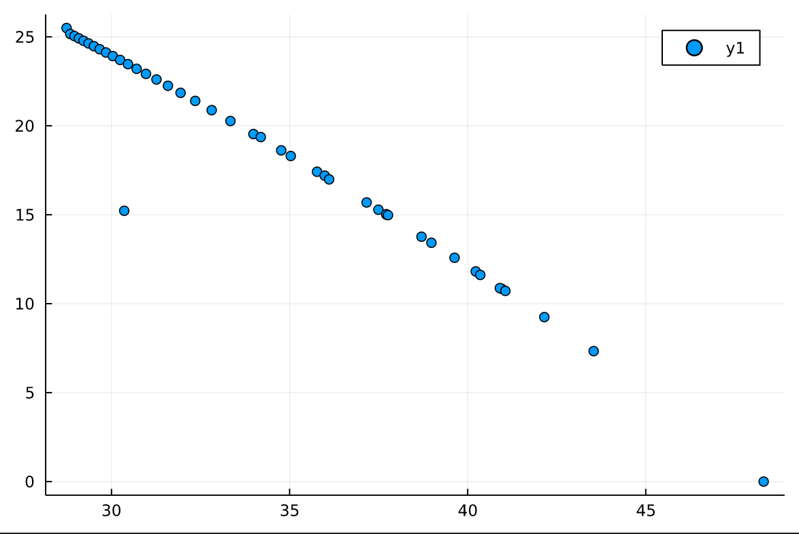
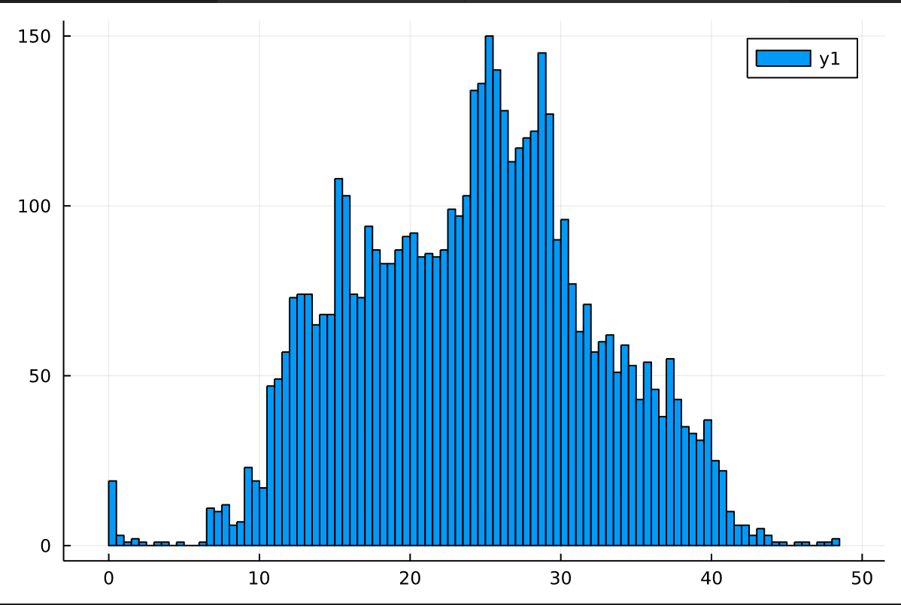
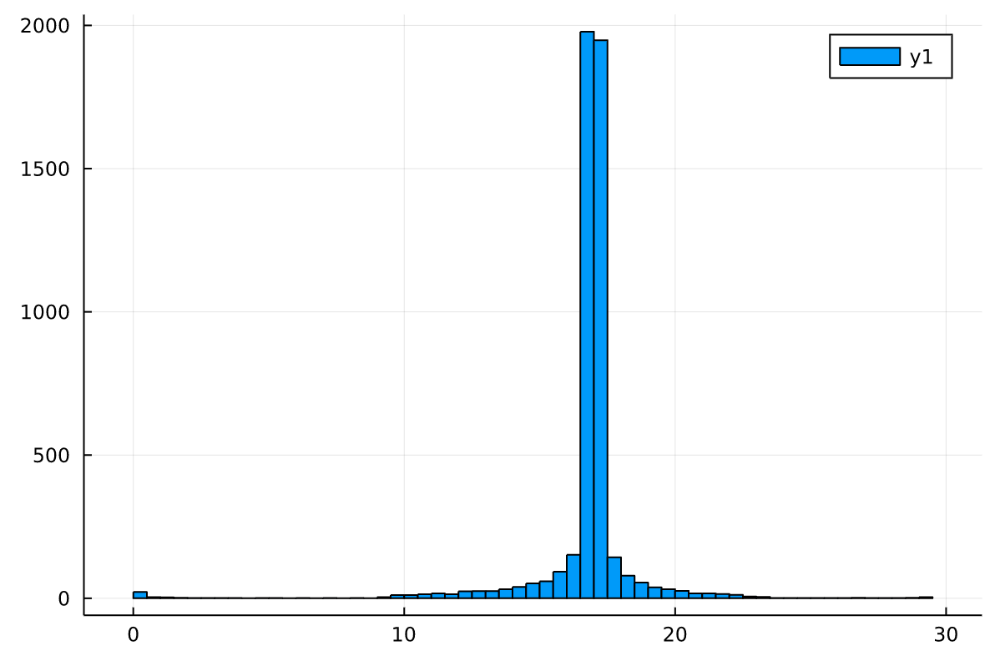
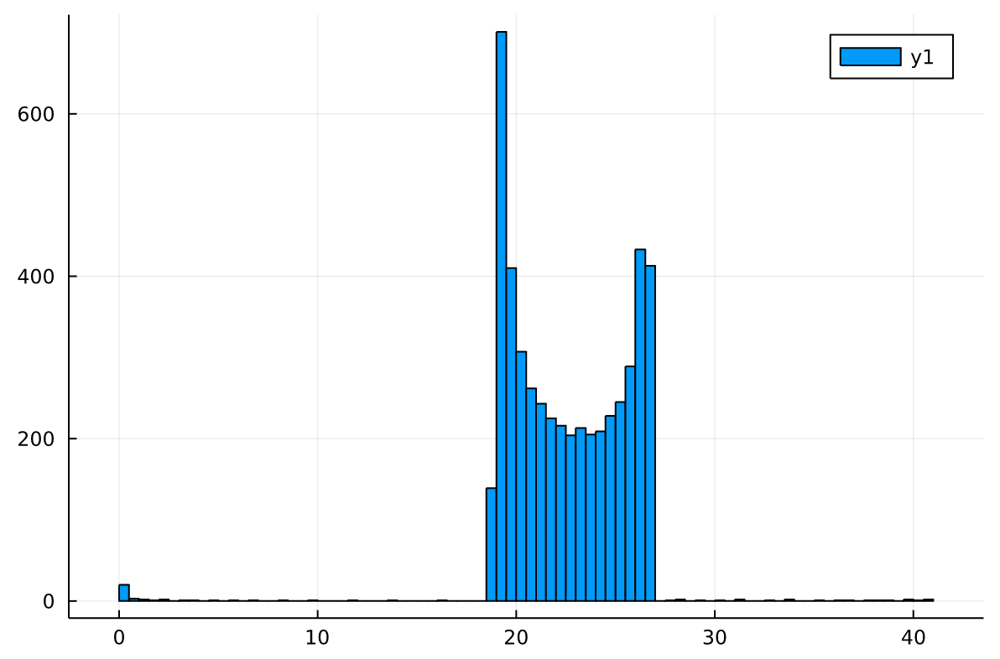
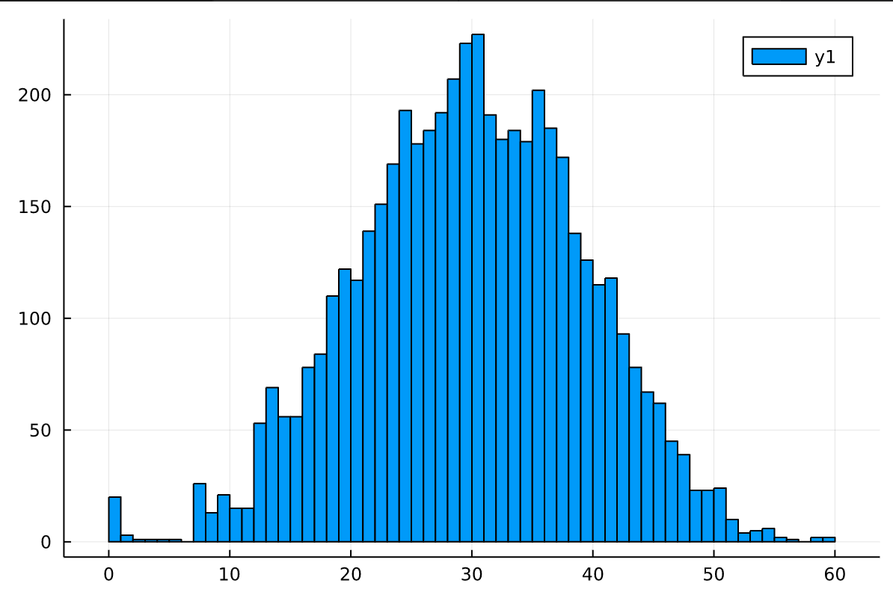
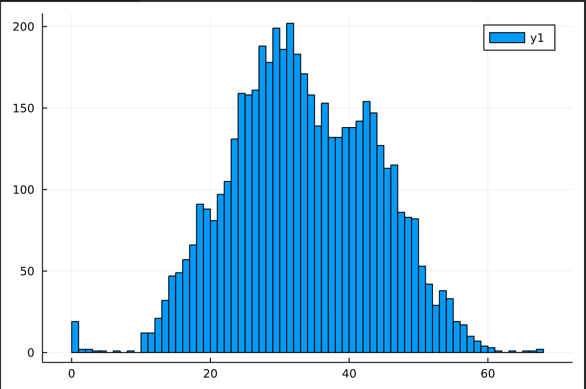

## 3/7
### plots
first Z maxima plot: (σ = 10, ρ = 28, β = 8/3)

corresponding Z values:

corresponding Z max/min plot:

### exploring different parameter values
- for σ=10 and β=8/3, ρ=24 seems to be the threshold value between a decaying value of Z and the chaotic attractor system
- for σ=10 and ρ=28, the β parameter seems to control the "tightness" of the spirals
- for β=8/3 and ρ=28, the σ parameters seems to control the relationship between the two leaves of the attractor (within roughly the 5 to 15 range), and the general behavior/stability of the system at lower and higher values

## 3/14
for ρ=28, 5000 runs: distribution of Z values:
(in the same run, Z spent roughly 50/50 time around the mean)

(all of these are for 5000 runs)

for ρ=18:

for ρ=24:

for ρ=34:

for ρ=38:

## 3/28
looking at holding times:
for 5000 runs, ρ=28, threshold = 24.7

for 10000 runs, 

4/16

3×3 Matrix{Float64}:
 0.0  0.475787  0.0
 1.0  0.0       1.0
 0.0  0.524213  0.0

(I think this is the "jump chain")

once I fixed that, I'm getting:
probability constructed directly is
 0.964583   0.0225267  0.0
 0.0354171  0.949925   0.0667942
 0.0        0.0275486  0.933206
and probability constructed via T and holding scale is
 0.999299     0.000445696  2.94705e-7
 0.000700736  0.999009     0.00132113
 1.91101e-7   0.000544886  0.998679

(they converge, actually!)
for 300k runs:
direct probability:
 0.964155   0.0236064  0.0
 0.0358449  0.947765   0.0671552
 0.0        0.0286284  0.932845

direct to T:
 0.965196     0.0225999  0.000752862
 0.0343167    0.950418   0.0632936
 0.000487338  0.0269821  0.935954
 