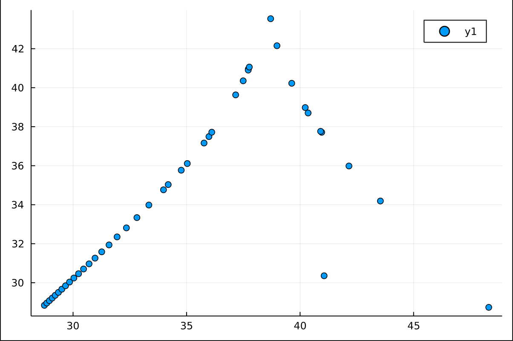

## 3/7
### plots
first Z maxima plot: (σ = 10, ρ = 28, β = 8/3)

corresponding Z values:

corresponding Z max/min plot:

### exploring different parameter values
- for σ=10 and β=8/3, ρ=24 seems to be the threshold value between a decaying value of Z and the chaotic attractor system
- for σ=10 and ρ=28, the β parameter seems to control the "tightness" of the spirals
- for β=8/3 and ρ=28, the σ parameters seems to control the relationship between the two leaves of the attractor (within roughly the 5 to 15 range), and the general behavior/stability of the system at lower and higher values